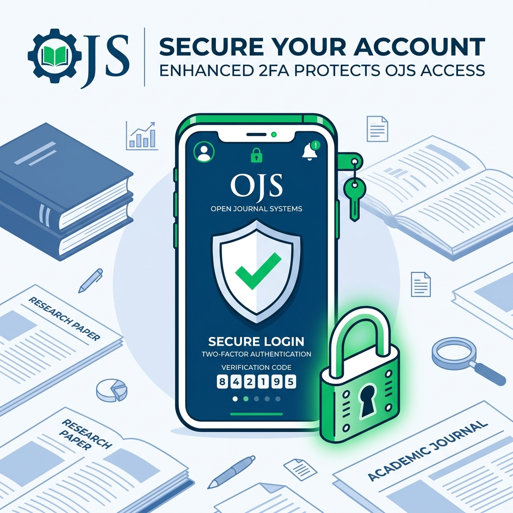

<div align="center">
  
  <h1>🛡️ OJS 2FA Plugin</h1>
  <p><strong>Two-Factor Authentication (2FA) for Open Journal Systems (OJS)</strong></p>
  <p>Protect your editorial data, reviewer insights, and author manuscripts from unauthorized access.</p>

  <a href="https://pkp.sfu.ca/ojs/"></a>
  
  
</div>

<hr/>

## 🌟 Overview
The **Gomit 2FA Plugin** seamlessly integrates **Two-Step Verification (2FA)** into your Open Journal Systems (OJS). By requiring a Time-Based One-Time Password (TOTP) from an authenticator app (like Google Authenticator, Authy, or Microsoft Authenticator) alongside standard credentials, this plugin adds a robust secondary layer of defense against credential theft and brute-force attacks.

## 🚀 Key Features
- **Seamless Integration**: Injects the 2FA settings menu natively into the user's dropdown menu (frontend & backend dashboard).
- **QR Code Setup**: Easy pairing with any standard Authenticator app via QR Code scanning.
- **Backup Codes**: Generates single-use backup codes for emergency access in case the user loses their phone.
- **Role-Based Enforcement**: Automatically enforces 2FA verification across all editorial and administrative roles.
- **No Core Hacks Required**: Fully utilizes OJS plugin hooks for a clean and persistent installation.

---

## 📥 Installation (OJS 3.3.0)

1. Download or clone this repository:
   ```bash
   git clone -b ojs-3.3.0-13 https://github.com/Cv-Media-Inti-Teknologi/OJS-2FA.git gomit2fa
   ```
2. Move the `gomit2fa` folder into your OJS installation directory under:
   `plugins/generic/gomit2fa`
3. Enable the plugin via the **Website Settings > Plugins > Generic Plugins** gallery in your OJS Dashboard, OR via CLI:
   ```bash
   php tools/upgrade.php upgrade
   ```

---

## 📖 Usage Instructions

### 1. Activating 2FA for Your Account
Once the plugin is enabled globally, each user must individually set up 2FA for their account:
1. Log into your OJS account.
2. Click on your Profile Dropdown (top right corner).
3. Select **2FA Settings**.
4. Click **Start 2FA Setup**.
5. Open an Authenticator app on your smartphone and scan the displayed **QR Code**.
6. Enter the **6-digit code** generated by the app to verify.
7. **Crucial:** Copy and save the provided **Backup Codes** in a secure offline location.

### 2. Logging In With 2FA
1. Enter your standard username and password on the OJS login page.
2. You will be redirected to the **2FA Challenge Page**.
3. Open your Authenticator app and enter the current 6-digit code.
4. (Optional) If you have lost your phone, enter one of your saved Backup Codes instead.

### 3. Disabling 2FA
1. Navigate back to **Profile > 2FA Settings**.
2. Enter a current OTP or Backup Code to confirm your identity.
3. Click **Disable 2FA**.

### 4. Manual URL Access (Direct Link)
If your active journal theme hides the profile dropdown or you are unable to locate the "2FA Settings" button, you can access the configuration page directly by modifying your journal's URL.

Simply append `/gomit2fa/settings` to your base journal path. For example:
- `https://your-domain.com/index.php/your-journal/gomit2fa/settings`
- Or if using clean URLs: `https://your-domain.com/your-journal/gomit2fa/settings`

---

## ❓ FAQ & Troubleshooting

**Q: I enabled the plugin, but the "2FA Settings" menu does not appear in my profile dropdown. What should I do?**  
**A:** This is usually caused by the OJS template caching system. If you encounter issues with the settings link not appearing immediately, please clear the OJS template cache via the Admin Dashboard or by running the following command in your terminal:
```bash
rm -rf cache/t_compile/*
```

**Q: What happens if I lose my phone and cannot generate the 6-digit code?**  
**A:** You can use one of the one-time **Backup Codes** generated during your initial setup. We strongly recommend saving these codes in a secure, offline location.

<hr/>
<div align="center">
  <p>Developed with ❤️ by the Gomit Engineering Team</p>
</div>
